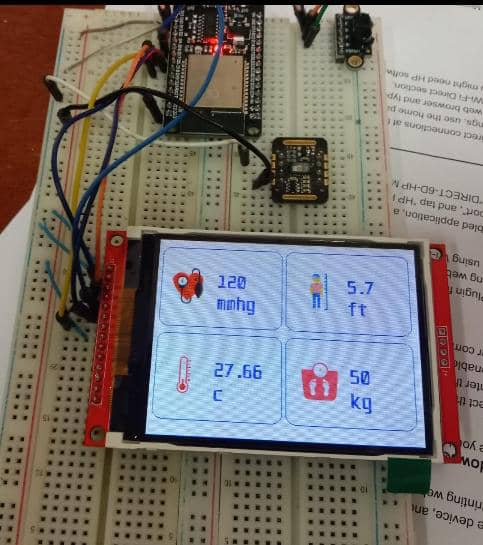

# ProjectWork
Link to figma file
https://www.figma.com/file/x66WFrfN1Yn1Bww0zCYFTn/Untitled?node-id=0%3A1

### API 
The project includes an API that uses Flask to handle databases and simple requests. These requests were created using Flask.
- fetch user, doctor, nurse, and sensor data 
- add user (patient), doctor, nurse, and sensor data
- login requests, registrations, appointments, checks, viewing of health information, etc.

railway, which makes it simple to deploy Flask apps, hosted the API.
SQLlite db is the database server in use.
  base_URL =https://vitalcheckapiv2-vitalcheckapiv2.up.railway.app/api/

### api Endpoints
|Status    |    Method    |            EndPoint    |
| :-----:  | :----------: | :--------------------: |
|    DONE  |     post     | base_URL+sensor_data   |
|   DONE   |     GET      |  base_URL+sensorData   |
|   DONE   |     POST     | base_URL+login         |
|   DONE   |     GET      | base_URL+user          |
| !STARTED |     post     | base_URL+doctor        |
| !STARTED |     GET      | base_URL+doctors       |
| !STARTED |     post     | base_URL+nurse         |
| !STARTED |     post     | base_URL+nurses        |
| !STARTED |     post     | base_URL+appointment   |
| !STARTED |     GET      | base_URL+appointments  |

### api Endpoints 
# post Sensor Data http Method POST
     http://10.10.64.255:8080/api/sensor_data/ce98f561-5021-4deb-ae0a-0e92395fbcb1
       {
          "bmp": 2.0,
          "height": 1.0,
          "temperature": 6.2,
          "weight": 2.0,
          "sensor_id":1,
          "user_id":"024c158a-7612-42bd-8278-c24fb907a2ac"

      }

# GET Sensor Data http Method GET
    http://10.10.64.255:8080/api/sensorData/ce98f561-5021-4deb-ae0a-0e92395fbcb1
    {
        "SensorData": {
            "Bmp": 5.72,
            "Height": 0.23,
            "Temp": 38.69,
            "id": 22,
            "weight": -0.01
        },
        "status": 200
    }

### Platforms 
     Platforms are divided into two categories: mobile apps and web applications.
     Mobile apps are used by patients to check information such as 
     vitals , appointment times, doctor availability, and health statistics.

# Mobile Platform
     FLutter was used for the mobile app which we used provider for state management 

     All Screens are completed and logics still in progress (ideation) 
     
# Web Platform
     Web Platform on hold since the project was built on top of an api to make it easy to 
     integrate with already existing web apps for some hospitals
     
     
     
# Hardware
     Microcontroller used was esp32 ,sensors include Max10302 for heart beat and pulse , 
     time of flight for measuring height,gy-906 for temperature,load cell for measuring weight. 
     the data collected was pushed to online server which can be access form the api section.

# Display

     

     
